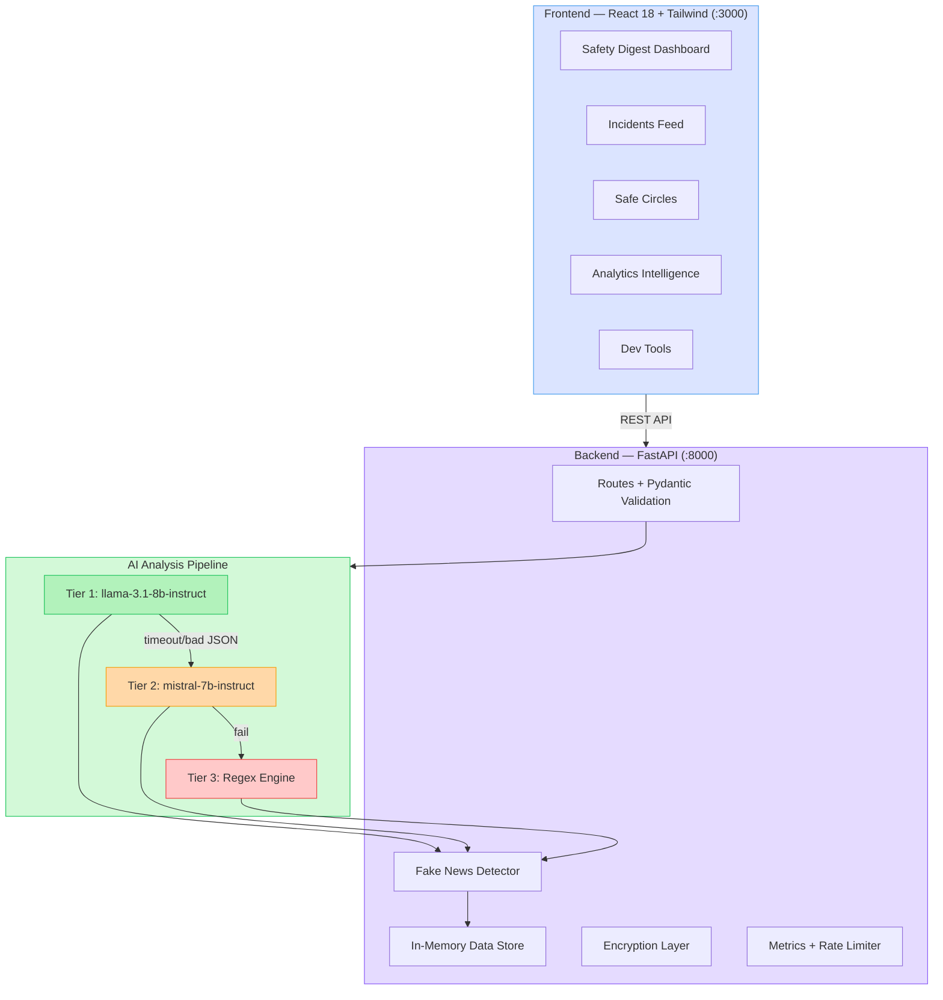
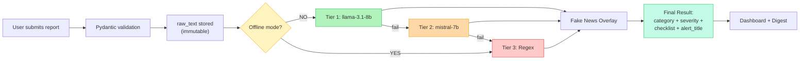
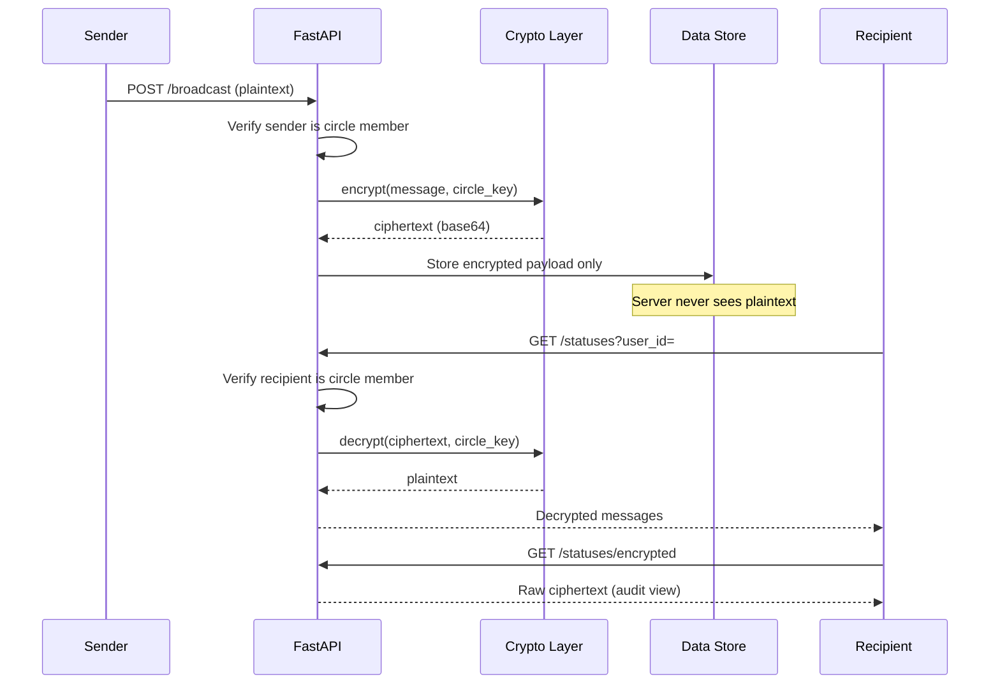

# Community Guardian

AI-powered community safety platform that aggregates local safety and digital security data, filters out noise, and delivers calm, actionable safety digests. Built for the Palo Alto Networks FY26 New Grad SWE Take-Home Case Study (Scenario 3: Community Safety & Digital Wellness).

**Candidate Name:** Mazin Saleh

**Scenario Chosen:** Community Safety & Digital Wellness

**Estimated Time Spent:** ~6 hours

**Video Demo:** [YouTube Link] https://youtu.be/-Wky1xEzamM 

---

## Quick Start

### Prerequisites

- Python 3.11+ and pip
- Node.js 18+ and npm
- A UF NaviGator API key (or use Offline Mode for regex-only analysis)

### Run Commands

```bash
# One-command setup (installs backend + frontend dependencies)
chmod +x init.sh && ./init.sh

# Terminal 1 — Backend
cd backend && source venv/bin/activate && uvicorn main:app --reload --port 8000

# Terminal 2 — Frontend
cd frontend && npm run dev
```

Open `http://localhost:3000` in your browser.

### Test Commands

```bash
cd backend && source venv/bin/activate && pytest -v
```

### Environment Variables

Copy `.env.example` to `backend/.env` and add your API key:

```
UF_NAVIGATOR_API_KEY=your-api-key-here
UF_NAVIGATOR_BASE_URL=https://api.ai.it.ufl.edu/v1
UF_PRIMARY_MODEL=llama-3.1-8b-instruct
UF_FALLBACK_MODEL=mistral-7b-instruct
```

No API key? No problem — toggle **Offline Mode** in Dev Tools to use regex-only analysis.

---

## Architecture

### System Overview



### Incident Lifecycle



### Safe Circles Encryption Flow



Every incident passes through the pipeline on creation. If Tier 1 times out or returns bad JSON, it falls to Tier 2. If both LLMs fail, the regex engine guarantees classification with zero downtime. Each incident's `analysis_method` field records which tier actually processed it, so you can always audit the pipeline.

---

## Core Features

### 1. Incident CRUD + Search/Filter (Core Flow)

Full create/view/update/delete lifecycle. Submit a report, get instant AI classification, browse the incident feed with filters for category, severity, zone, status, and free-text search. Noise is hidden by default on the main incidents page.

### 2. Three-Tier AI Pipeline + Fallback

The main AI capability is **Categorize** — each incident gets classified into one of 9 categories (Phishing, Malware, Physical Hazard, Network Breach, Natural Disaster, Scam, Suspicious Activity, Infrastructure Failure, Noise) with a severity level and a 3-step actionable safety checklist.

- **AI mode**: LLMs via UF NaviGator provide nuanced classification, custom alert titles, and context-aware checklists
- **Regex mode**: A deterministic keyword engine handles the same classification when AI is unavailable
- **Offline Mode toggle**: One click in Dev Tools switches everything to regex — useful when there's no internet or API key

### 3. Fake News Detection

An overlay layer runs after classification to flag potential misinformation:
- Linguistic markers (ALL CAPS, excessive punctuation, urgency phrases like "NOT A DRILL")
- Reporter trust scoring (new/anonymous reporters get lower trust)
- Single-source flagging when a high-severity report has no corroborating incidents

### 4. Safety Digest Dashboard

The home page answers "Am I safe?" at a glance. A single hero card shows the current safety level (All Clear / Some Activity / Stay Alert) with a plain-language summary. The palette is intentionally warm — ivory, sage green, terracotta — designed to reduce anxiety rather than amplify it.

### 5. Privacy-First Safe Circles

Small encrypted groups for families and friends to check in during emergencies. Messages are XOR-encrypted before storage (a stand-in for AES-256-GCM in production). The server only stores ciphertext. Members can toggle between decrypted chat view and an "Audit View" that shows the raw ciphertext the server actually stores.

Quick status buttons ("I'm Safe", "Need Help", "On My Way") let people communicate with one tap.

### 6. Analytics Intelligence

- **Zone Safety Scores**: Per-sector safety scores across 9 Palo Alto zones
- **Trending Threats**: Categories changing the most (7-day vs prior 7-day comparison)
- **Cross-Zone Correlations**: Detects when the same threat type appears in 3+ zones
- **Analysis Method Ratio**: Visual breakdown of AI vs regex processing

### 7. Dev Tools (Developer Mode)

Side-by-side comparison of AI vs regex output for any scenario. Includes:
- Model selector (switch active LLM at runtime)
- Offline Mode toggle
- "Upgrade All to AI" button to bulk re-process regex incidents through the LLM
- Live metrics showing AI/Regex/Total counts

---

## Synthetic Data

`data/synthetic_incidents.json` contains 75 synthetic incidents across all 9 categories and sectors. Includes:
- High-fidelity signals (real threats with specific details)
- Semantic noise (venting, complaints, off-topic posts)
- Varied severity levels and zones

No real personal data is used anywhere in the project.

---

## Testing

79 tests covering happy paths, edge cases, and integration:

```bash
cd backend && source venv/bin/activate && pytest -v
```

| Test File | What It Covers |
|-----------|---------------|
| `test_happy_path.py` | CRUD operations, AI analysis pipeline, input validation |
| `test_fallback.py` | Both LLMs fail → regex fallback classifies correctly |
| `test_edge_cases.py` | Empty text, long strings, missing fields |
| `test_fake_news.py` | Hyperbolic language detection, trust scoring, auto-quarantine |
| `test_integration.py` | Full create→analyze→resolve pipeline, analytics endpoint |
| `test_safe_circles.py` | Circle CRUD, encryption/decryption, member access control |
| `test_model_toggle.py` | Runtime model switching, invalid model rejection |
| `test_analytics.py` | Zone scores, category distribution, trending threats |
| `test_rate_limiter.py` | Burst protection, per-IP isolation, window expiry |
| `test_audit_trail.py` | Immutable raw_text, audit history on updates |
| `test_observability.py` | Metrics endpoint, AI/regex counters |
| `test_resources.py` | Emergency resources filtering by zone and category |

---

## API Endpoints

| Method | Endpoint | Description |
|--------|----------|-------------|
| POST | `/api/incidents` | Create + AI-analyze an incident |
| GET | `/api/incidents` | List incidents (filter by category, severity, zone, search, status) |
| GET | `/api/incidents/{id}` | Incident detail |
| PATCH | `/api/incidents/{id}` | Update verification/severity |
| DELETE | `/api/incidents/{id}` | Delete incident |
| POST | `/api/incidents/{id}/resolve` | Resolve an incident |
| POST | `/api/incidents/demo-fallback` | Force regex-only analysis (dev) |
| POST | `/api/incidents/upgrade-to-ai` | Bulk re-process regex incidents through AI |
| GET | `/api/digest` | Safety digest (safety level, top alerts, zone scores) |
| GET | `/api/analytics/overview` | Full analytics (trends, correlations, distributions) |
| GET/POST | `/api/config/model` | Get/set active LLM model |
| POST | `/api/config/offline` | Toggle offline mode |
| POST | `/api/circles` | Create a Safe Circle |
| GET | `/api/circles?user_id=` | List circles for a user |
| POST | `/api/circles/{id}/broadcast` | Send encrypted message |
| GET | `/api/circles/{id}/statuses?user_id=` | Read decrypted messages (members only) |
| GET | `/api/circles/{id}/statuses/encrypted` | Audit view (raw ciphertext) |
| GET | `/api/metrics` | AI vs regex incident counts |
| GET | `/api/health` | Health check + uptime |
| GET | `/api/resources` | Emergency resources (filterable by zone/category) |

---

## Tech Stack

| Layer | Technology |
|-------|-----------|
| Backend | Python 3.11+, FastAPI, Pydantic, OpenAI SDK (UF NaviGator) |
| Frontend | React 18, Vite, Tailwind CSS |
| AI Models | llama-3.1-8b-instruct, mistral-7b-instruct (via UF NaviGator API) |
| Fallback | Python regex engine with keyword-category mapping |
| Encryption | XOR + base64 (demo; production would use AES-256-GCM) |
| Tests | pytest, pytest-asyncio, unittest.mock |

---

## Design Documentation

### Why I built it this way

The core problem with existing safety apps (Citizen, Nextdoor) is that they amplify anxiety. Every minor complaint gets the same weight as a real threat, and users end up more stressed than informed. Community Guardian flips that — the AI pipeline's main job isn't just classification, it's **filtering noise out** so only actionable incidents reach the user.

I chose a **three-tier fallback architecture** because reliability matters more than AI sophistication in a safety context. If someone reports a gas leak and the LLM is down, they still need a response. The regex engine isn't as nuanced, but it classifies every category and generates checklists that are good enough to act on. The `analysis_method` field on every incident makes this transparent — you can always see which tier handled it.

The **Calm Technology** approach drove the frontend design. Instead of red alerts everywhere, the default state is a warm ivory/sage palette. The critical alert banner only appears when there's an actual critical or high-severity incident. Noise-category incidents are hidden by default. The safety digest answers "Am I safe?" in plain language rather than dumping a feed of reports.

**Safe Circles** exist because during emergencies, people don't need a social network — they need to tell their family "I'm okay" with one tap. The encryption layer (XOR for demo, but architecturally ready for AES-256-GCM) means the server genuinely cannot read messages. The audit view toggle proves this to the user.

### Design decisions

| Decision | Reasoning |
|----------|-----------|
| In-memory data store | Fast iteration, no DB setup for reviewers. Tradeoff: data resets on restart. |
| XOR encryption over AES | Demonstrates the privacy-first architecture without a `cryptography` dependency. One-file swap to production-grade. |
| Regex fallback covers all 9 categories | The app must work identically offline. I mapped every category to keyword patterns so nothing breaks without AI. |
| Noise hidden by default | Reduces cognitive load. Users can toggle it back on if they want the full feed. |
| No auto-upgrade on startup | Background LLM tasks made metrics unpredictable. Moved to manual button so behavior is explicit. |
| Warm color palette | Intentional departure from the red/black security dashboards. Research shows warm tones reduce anxiety in safety contexts. |
| `raw_text` immutability | Forensic integrity — the original report can never be edited, only the AI analysis and verification status. |

### Future enhancements

With more time, I would add:
- **Persistent database** (PostgreSQL/Supabase) instead of in-memory storage
- **WebSocket real-time updates** instead of polling for new incidents
- **AES-256-GCM encryption** for Safe Circles with proper key derivation and exchange
- **User authentication** (JWT) with role-based access control
- **Geolocation-based zone detection** instead of manual zone selection
- **Push notifications** for critical alerts (only for verified critical/high — respecting calm technology principles)
- **Incident clustering** — group related reports automatically using embedding similarity
- **Multi-language support** — the regex fallback would need localized keyword sets

### Known limitations
- Data resets on server restart (in-memory storage)
- Encryption is XOR-based (demo only, not production-grade)
- No user authentication — reporter IDs are self-assigned
- LLM responses depend on UF NaviGator API availability
- Rate limiter is per-IP in-memory (would need Redis in production)

---

## AI Disclosure

**Did you use an AI assistant?** Yes — Claude Code (Anthropic's CLI tool) for development assistance.

**How did you verify suggestions?** Every piece of generated code was tested against the backend test suite (79 tests) and manually verified in the browser. I checked API responses with curl, inspected the data store state, and confirmed the AI pipeline behavior by comparing AI vs regex outputs side-by-side in Dev Tools.

**Example of a suggestion I rejected:** Claude initially suggested auto-running a background LLM upgrade task on every server startup to re-process regex incidents through AI. I rejected this because it made the metrics unstable — the numbers would change silently between page loads. Instead, I moved it to a manual "Upgrade to AI" button so the behavior is explicit and predictable during demos.

---

## Project Structure

```
Palo_Alto/
├── backend/
│   ├── main.py              # FastAPI app, startup lifecycle
│   ├── routes.py            # All API endpoints
│   ├── ai_engine.py         # Three-tier AI pipeline
│   ├── regex_fallback.py    # Deterministic regex classifier
│   ├── fake_news_detector.py # Misinformation overlay
│   ├── models.py            # Pydantic schemas
│   ├── data_store.py        # In-memory data layer
│   ├── analytics.py         # Zone scores, trends, correlations
│   ├── crypto_utils.py      # XOR encryption for Safe Circles
│   ├── config.py            # Environment config + offline mode
│   ├── metrics.py           # AI/regex counters
│   ├── rate_limiter.py      # Per-IP rate limiting
│   ├── emergency_resources.py # Zone-specific safety resources
│   └── tests/               # 79 tests (12 test files)
├── frontend/
│   └── src/
│       ├── pages/            # Dashboard, Incidents, Analytics, Circles, Report, DevTools
│       ├── components/       # Sidebar, Toast, IncidentDetail, KeyboardShortcuts, etc.
│       ├── layouts/          # AppLayout with critical alert banner
│       ├── api.js            # All backend API calls
│       └── utils/constants.js # Shared constants, severity colors, zone labels
├── data/
│   └── synthetic_incidents.json  # 75 synthetic incidents
├── docs/
│   └── strategy_blueprint.md     # Detailed architecture analysis
├── .env.example
├── .gitignore
├── CLAUDE.md                     # Project coding standards
└── init.sh                       # One-command setup script
```
